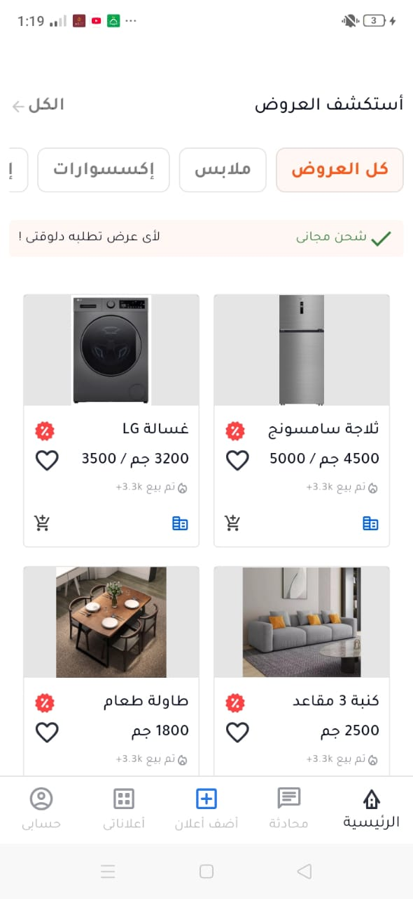
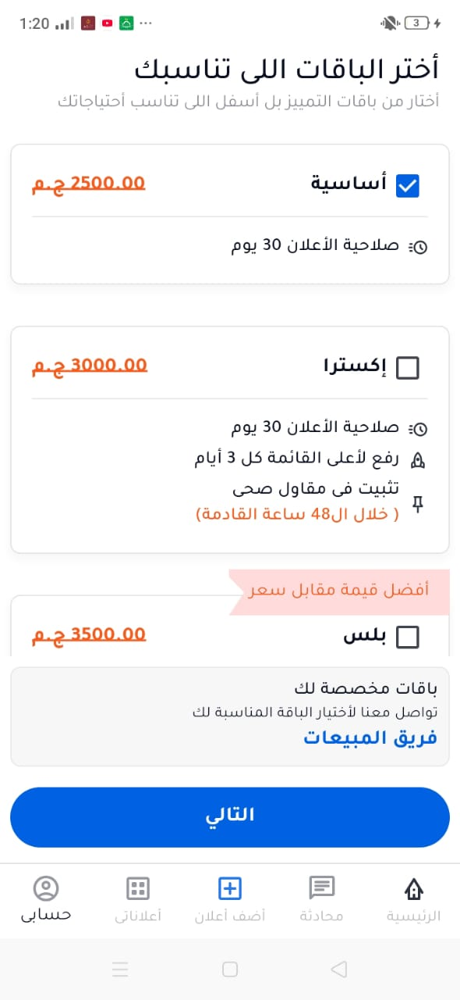
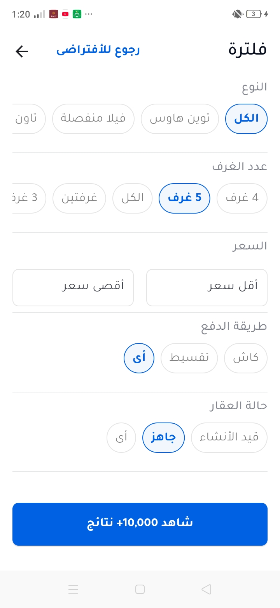

# Otex App - Flutter Task

A Flutter e-commerce application showcasing product browsing, category filtering, and subscription plans.

## 📱 Screenshots

| Home Screen | Plans Screen | Filter Screen |
|:-----------:|:------------:|:-------------:|
|  |  |  |

## 🚀 Features

- **Product Catalog**: Browse products with grid layout
- **Category Filtering**: Filter products by categories
- **Search Functionality**: Find products by name or description
- **Subscription Plans**: View and select different subscription tiers
- **Local Database**: SQLite integration for offline data persistence
- **State Management**: Bloc/Cubit for efficient state handling
- **Responsive UI**: Arabic language support with RTL layout

## 🏗️ Project Structure

```plaintext
lib/
├── controller/           # Business logic & state management
│   ├── home_cubit.dart
│   └── home_state.dart
├── models/              # Data models
│   ├── category.dart
│   ├── product.dart
│   └── plan.dart
├── views/               # UI screens & widgets
│   ├── home_view.dart
│   └── filter_view.dart
├── helper/              # Utilities & services
│   ├── database_helper.dart
│   ├── app_assets.dart
│   ├── app_colors.dart
│   └── app_styles.dart
├── main.dart           # App entry point
├── otex_app.dart       # Main app widget
└── root.dart           # Root configuration
