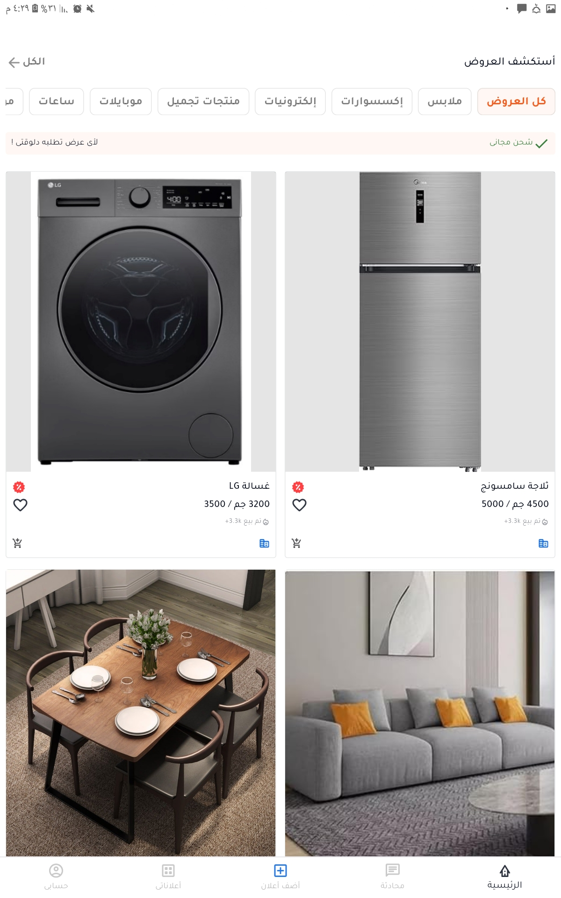
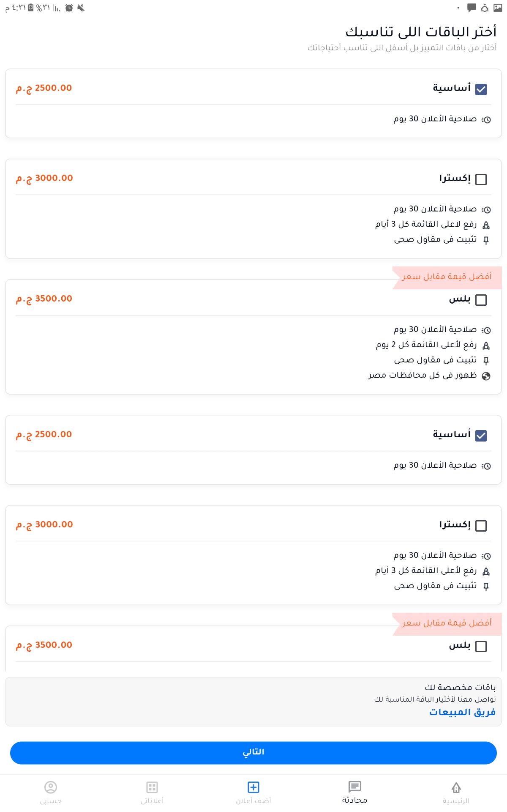
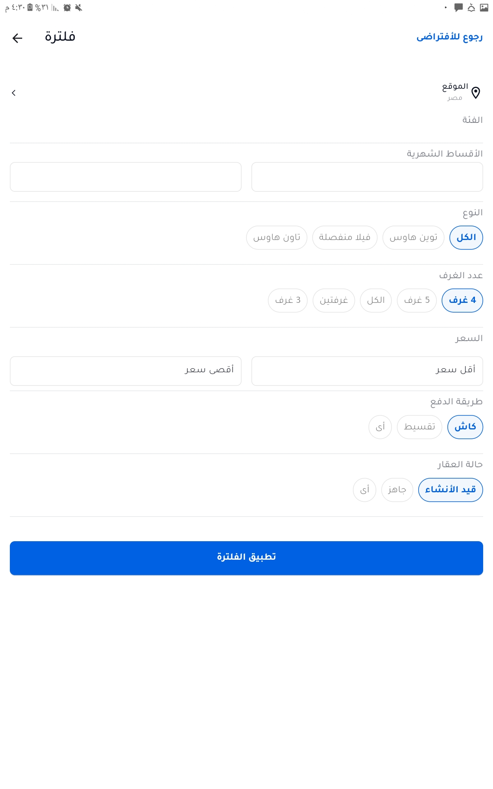

# flutter-task-Aya_Abdelmoneim

## Screens

Home Screen             |  Plans Screen           | Filtering Screen            
:-------------------------:|:-------------------------:|:-------------------------:
 | |


## Structure

```plaintext
lib/
├── helper/                 
├── controller/
├── controller/
├── view/
├── models/               
└── main.dart
└── root.dart
└── otex_app.dart
